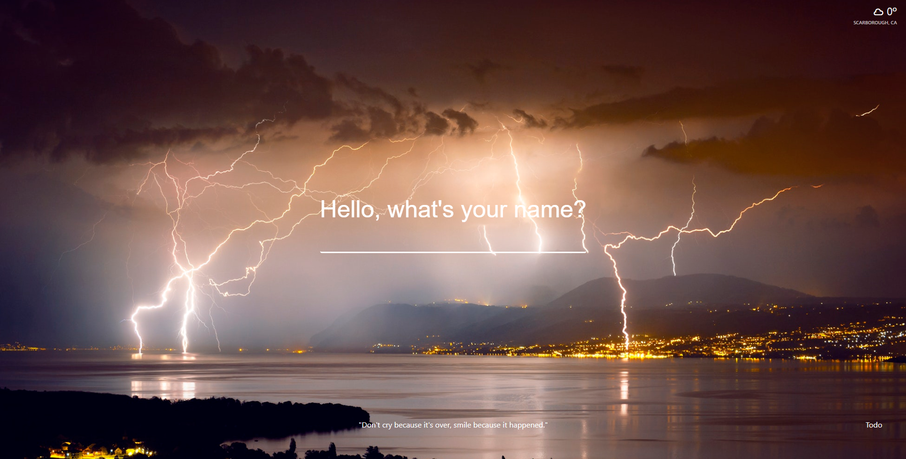

# Focus! A Momentum Google Chrome Extension Clone

A Google Chrome extension that helps you prioritize your daily goals

* **Technologies:** Javascript, HTML/CSS
* **Data Persistence**: In-browser local storage
* **API Integration**: Open Weather Map

Main features:

* Ability to set a daily and on-going goals
* Rotating background images
* Real-time weather report
* Available as a Google-Chrome Extension
* Data persistence via local storage

# Screenshot of the application

## Main Page

## Weather Report

## To-Do-List

